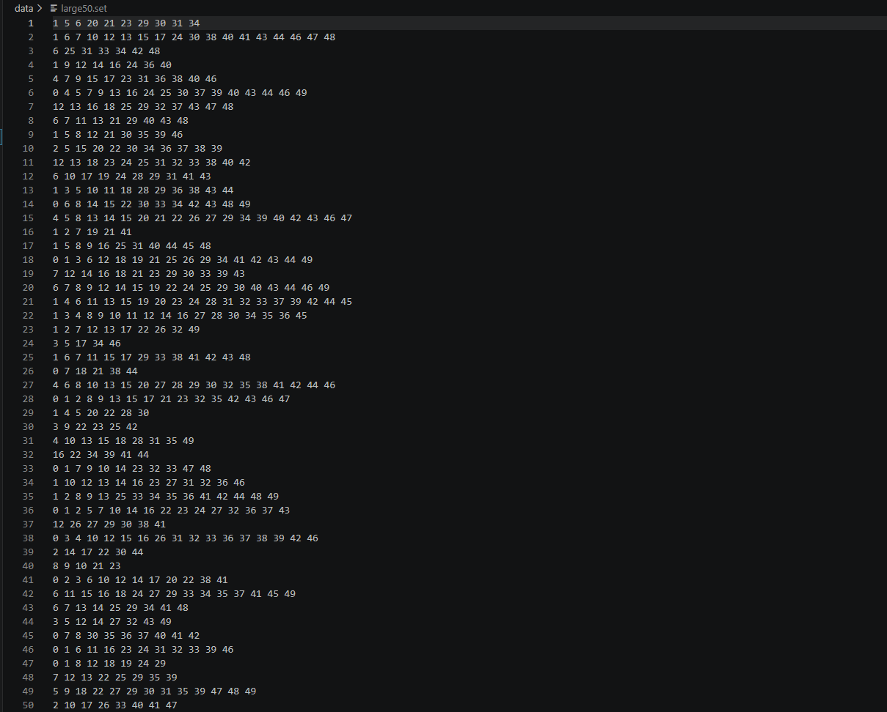

[Back to Portfolio](./)

Project 2 Title
===============

-   **Class:CSCI 315 : Data Structures Analysis ** 
-   **Grade: A** 
-   **Language(s): C++ ** 
-   **Source Code Repository:** [features/mastering-markdown](https://guides.github.com/features/mastering-markdown/)  
    (Please [email me](mailto:example@csustudent.net?subject=GitHub%20Access) to request access.)

## Project description

The purpose of this project is to implement an algorithm that determines the minimum number of overlapping sets required to cover all elements in a given input set. Each set represents a group of student IDs, and the goal is to select a combination of these groups so that all required students are included while minimizing the total number of students that must present. This project focuses on using efficient algorithms and data structures, particularly recursion and backtracking, to search for the optimal solution.


## How to compile and run the program

How to compile (if applicable) and run the project.

```bash
Inside your Terminal: cd CSCI-315-2025-Spring
then, cd project3
cd make clean (to clean the field)
cd make (small30, large50, medium30, small30-timings, or large50-timings)
```

## UI Design

This project uses a command-line interface. The user runs the program from the terminal and provides input sets through  data files (See Fig 1). The program processes the input and displays results directly in the terminal (See Fig 2), including the tested cover sets, the minimum number of elements required, and execution timing information. Output is formatted in a clear table-like structure so users can easily read and analyze the algorithm’s results. There is also an output for users to read via PDF (see Fig 3).

  
Fig 1. The Dashboard

  
Fig 2. 60 Second Quiz Game

  
Fig 3. Practice Mode

  
Fig 4. Matching Game

  
Fig 5. Performance Dashboard

For more details see [GitHub Flavored Markdown](https://guides.github.com/features/mastering-markdown/).

[Back to Portfolio](./)
