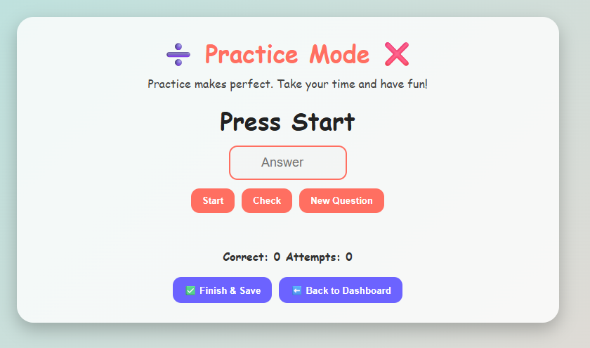
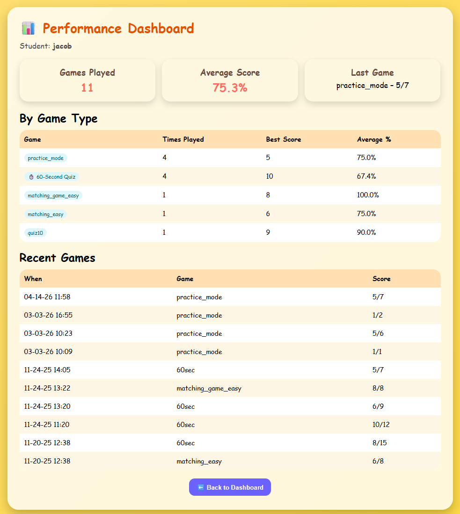

[Back to Portfolio](./)

 Document Analysis | CSCI 495
===============

-   **Class:CSCI 495** 
-   **Grade: A** 
-   **Language(s): HTML, Python** 
-   **Source Code Repository:** [features/mastering-markdown](https://guides.github.com/features/mastering-markdown/)  
    (Please [email me](mailto:example@csustudent.net?subject=GitHub%20Access) to request access.)

## Project description
Forecite Uploads is a web-based tool that allows users to upload documents for automated analysis. The system processes the uploaded files to extract citations, parse the content, and organize key information to support research and document review. This helps users quickly identify references and important material within academic or research documents.

## How to compile and run the program

How to compile (if applicable) and run the project.

```bash
Inside your python terminal:
cd CSCI\Database CSCI495
Use "python app.py"
```

## UI Design

The system is designed as a document processing and analysis platform that accepts uploaded research papers and automatically extracts useful information. When a user uploads a file, the system stores the document, generates metadata such as file size, page count, and a SHA-256 hash for identification, and then runs a parsing process to detect citations within the text.


  
Fig 1. The Dashboard

  
Fig 2. 60 Second Quiz Game

  
Fig 3. Practice Mode

  
Fig 4. Matching Game

  
Fig 5. Performance Dashboard

For more details see [GitHub Flavored Markdown](https://guides.github.com/features/mastering-markdown/).

[Back to Portfolio](./)
