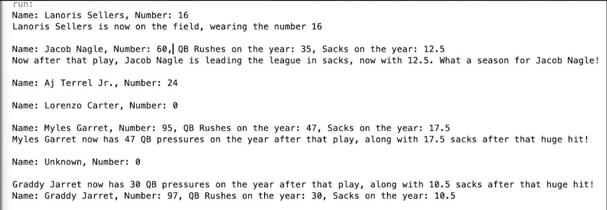

[Back to Portfolio](./)

Football Announcer | CSCI 325
===============

-   **Class:CSCI 325 : Object-Oriented Programming** 
-   **Grade: B** 
-   **Language(s): JavaScript** 
-   **Source Code Repository:** [features/mastering-markdown](https://guides.github.com/features/mastering-markdown/)  
    (Please [email me](mailto:JBNagle@student.csuniv.net?subject=GitHub%20Access) to request access.)

## Project description
This project involves creating a program that reads player data from another file and processes the information to identify position players. The program extracts relevant details such as player names, jersey numbers, and statistical data, then organizes and displays the information in a clear format. By parsing the file data and presenting the results, the program demonstrates how structured data can be processed and used to generate meaningful output.


## How to compile and run the program

How to compile (if applicable) and run the project.

```bash
Inside of NetBeans:
Run Program
```

  
Fig 1. Results


For more details see [GitHub Flavored Markdown](https://guides.github.com/features/mastering-markdown/).

[Back to Portfolio](./)
